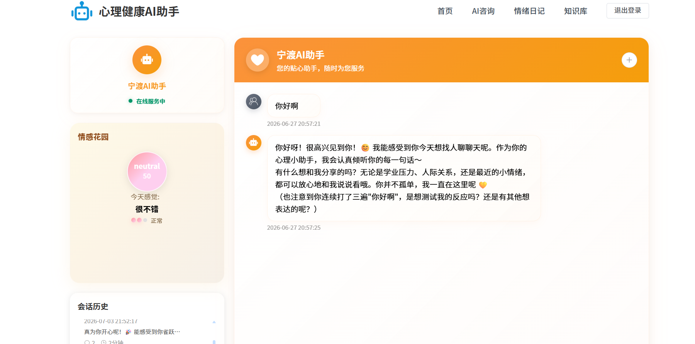
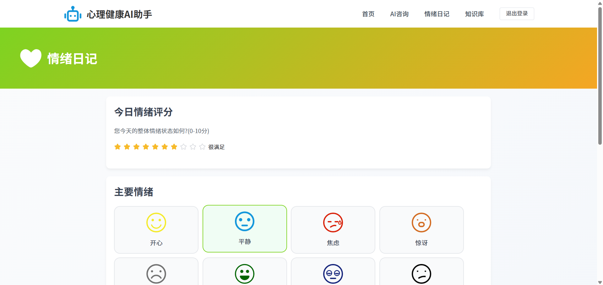
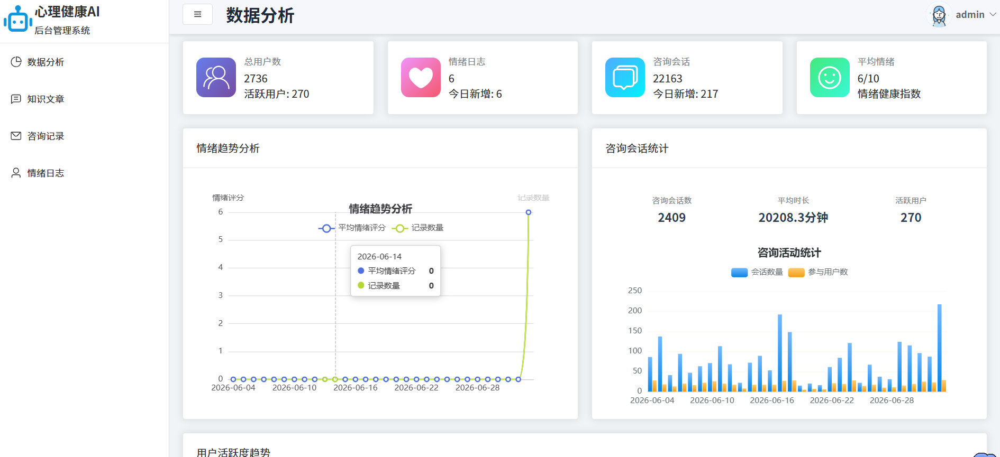
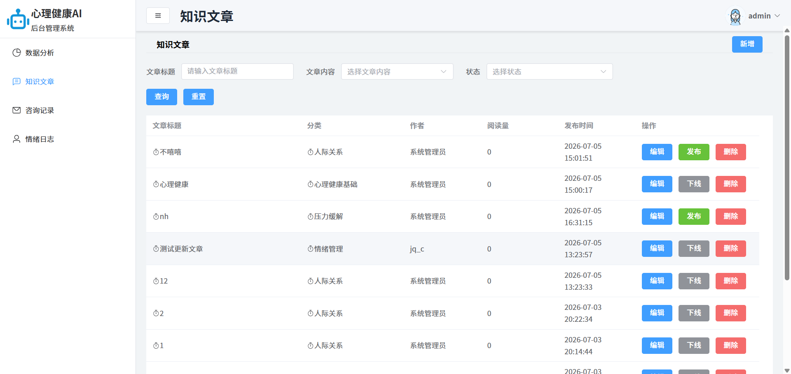
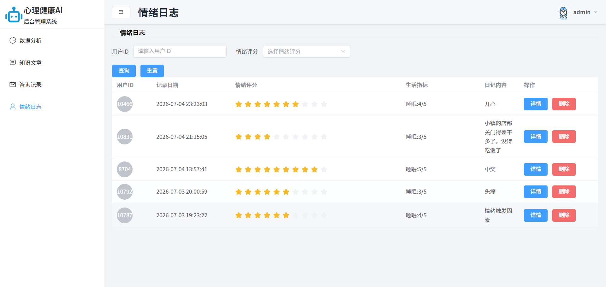
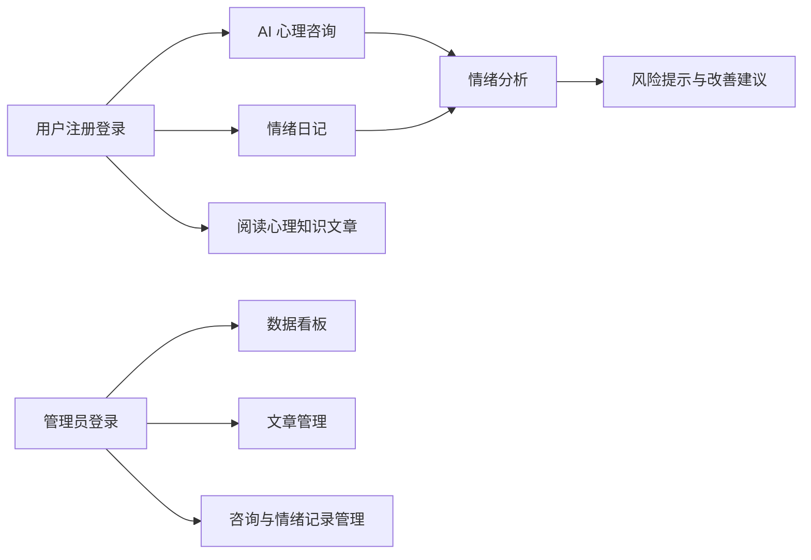
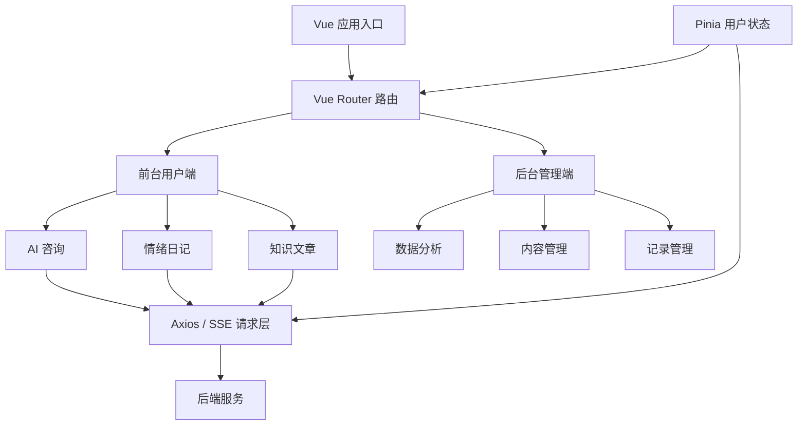

# AI Mental Health Assistant

一个基于 Vue 3 + Vite + Element Plus 的 AI 心理健康助手前端项目，围绕心理咨询对话、情绪日记、知识文章和后台数据管理构建完整的用户体验。项目适合展示「AI 应用产品设计 + 前端工程实现 + 后台管理」能力。

## 一、项目介绍

很多心理健康产品只提供单点功能：要么是聊天窗口，要么是情绪记录，要么是科普文章。AI Mental Health Assistant 把这些场景组织成一条更完整的心智支持链路：用户可以先与 AI 助手倾诉，再沉淀情绪日记，随后通过知识文章学习调节方法；管理员可以在后台维护内容、查看咨询记录和情绪数据。

> 说明：本项目定位为心理健康辅助工具，不替代专业医疗诊断、治疗或危机干预。如用户出现严重心理危机，应及时联系专业人士或当地紧急救助渠道。

## 二、界面预览

### AI 心理咨询



### 情绪日记



### 后台数据分析



### 后台知识文章



### 后台情绪日志



## 三、核心功能

1. AI 心理咨询

支持用户登录后发起 AI 对话，会话支持流式响应、历史记录、重新开启会话、停止回复和异常重连提示。对话侧边栏会展示情绪分析结果、风险提示和改善建议。

2. 情绪日记

用户可以记录当日心情和文字内容，系统提交后展示情绪分析结果，帮助用户追踪情绪变化。

3. 心理知识文章

提供知识文章列表、推荐阅读、分类标签、阅读量、作者和文章详情页，适合承载心理健康科普内容。

4. 后台管理

后台包含数据分析、知识文章管理、咨询记录管理和情绪日志管理，方便管理员维护内容与查看用户使用情况。

5. 登录与权限路由

使用 Pinia 管理用户状态和 token，路由守卫区分普通用户、管理员和未登录状态。

6. 统一请求封装

基于 Axios 封装 API 请求、token 注入、登录过期处理和错误提示；开发环境通过 Vite proxy 转发后端接口。

## 四、功能流程



## 五、技术栈

- 前端框架：Vue 3、Vite
- UI 组件：Element Plus、Element Plus Icons
- 状态管理：Pinia
- 路由管理：Vue Router
- 网络请求：Axios、Fetch Event Source
- 富文本编辑：wangEditor
- 数据可视化：ECharts
- 样式方案：SCSS

## 六、架构设计



## 七、项目结构

```text
.
├─ public/                 # favicon 与公共图标
├─ src/
│  ├─ api/                 # 后端接口封装
│  ├─ assets/              # 图片与静态资源
│  ├─ components/          # 通用布局、导航、编辑器、弹窗组件
│  ├─ config/              # 前端运行配置
│  ├─ router/              # 前后台路由与权限守卫
│  ├─ stores/              # Pinia 状态管理
│  ├─ utils/               # Axios 请求实例
│  └─ views/               # 前台页面与后台页面
├─ .env.example            # 环境变量示例
├─ vite.config.js          # Vite 配置与开发代理
└─ package.json
```

## 八、快速运行

### 1. 前置条件

- Node.js 18+
- npm 9+
- 可访问的后端 API 服务

### 2. 安装依赖

```bash
npm install
```

### 3. 配置环境变量

```bash
cp .env.example .env
```

按需修改：

```bash
VITE_API_PROXY_TARGET=http://localhost:1235
VITE_FILE_BASE_URL=http://localhost:1235
```

### 4. 启动开发环境

```bash
npm run dev
```

浏览器访问 Vite 输出的本地地址，通常是：

```text
http://localhost:5173
```
C端测试账号：yzj4157 密码：751420
B端测试账号：admin 密码：123456
### 5. 构建生产包

```bash
npm run build
```

## 九、主要页面

- `/`：项目首页
- `/consultation`：AI 心理咨询
- `/emotion-diary`：情绪日记
- `/knowledge`：心理知识文章列表
- `/knowledge-detail/:id`：文章详情
- `/auth/login`：登录
- `/auth/register`：注册
- `/back/dashboard`：后台数据分析
- `/back/knowledge`：后台文章管理
- `/back/consulation`：后台咨询记录
- `/back/emotional`：后台情绪日志

## 十、接口说明

前端默认通过 `/api` 访问后端。开发环境中，Vite 会把 `/api` 转发到 `VITE_API_PROXY_TARGET`。

常见接口模块：

- `src/api/admin.js`：登录、文章管理、文件上传等后台接口
- `src/api/fontend.js`：前台知识文章、情绪分析、会话列表等接口
- `src/api/startSession.js`：创建咨询会话
- `src/api/consulation.js`：咨询记录与会话详情
- `src/api/emotion.js`：情绪日志管理
- `src/api/dashboard.js`：后台数据看板

## 十一、测试与校验

当前项目主要使用构建校验：

```bash
npm run build
```

建议后续补充：

- ESLint 脚本与统一格式化配置
- 关键组件单元测试
- 登录、咨询、情绪日记等核心流程的端到端测试

## 十二、项目亮点

- 不是单页 Demo，而是包含用户端和管理端的完整业务前端。
- AI 咨询使用 SSE 流式输出，包含中断、重连、错误提示等真实交互细节。
- 路由守卫区分管理员和普通用户，具备基础权限模型。

